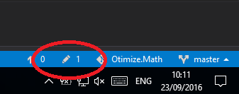

I decided to give another architecture and implementation of the math functions and operations I currently use at one of the produce I currently work with.

Although I was willing to create a .NET Core or PCL class library, I will stick with a .NET 4.0 library so all my current solution projects can reference it.

Either way, one of the concerns in the library is to use more primitive types so the future migration to a cross platform library will be less painful.

For example, my current geometric functions like the ones to calculate segment offset, arc intersections and many other uses PathGeometry objects, that depends on PresentationCore.dll wich is very Windows specific.

## Using Git

As I still did not have chance to work in a real project with Git and since it has a lot of adoption of the community, I decided this will be my first real Git controlled project. To be honest, I still did not hit any of the limitations people say about TFS, but that will be good to stay on the heap.

It seems Visual Studio is giving more Git command support on its GUI. I confess I am not a big fan of command line for recurring manual operations like commits, push, etc. Since we already have a GUI, we should use it as much as we can.

So I created a new project in [Visual Studio Team Services](https://www.visualstudio.com/en-us/products/visual-studio-team-services-vs.aspx) using Git.

That was great, until I realized most git controller projects follow a [folder structure convention](https://github.com/kriasoft/Folder-Structure-Conventions) I suspect is popular on GitHub.

So I managed to create the folder structure following the convention.

I spent a lot of time trying to figure out how to make the first push after adding the files and projects. For some reason I did not noticed the "changes" tab inside my local repository. You can also quickly access this option using the bottom right status bar on Visual Studio:

So the first big challenge here is to create a Spline to PolyLine Converter. This seems a lot of commitment for a first version, so we are going in baby steps here.

As we do have some implementation of this and other geometric features in our current product, our initial roadmap will be:

1 - Create a basic Class on the new library, like Point2D;
2 - Add Continuous Integration to the solution;
3 - Create and publish the library NuGet package;
4 - Reference the package in other projects and start bringing new Math features to the library;

