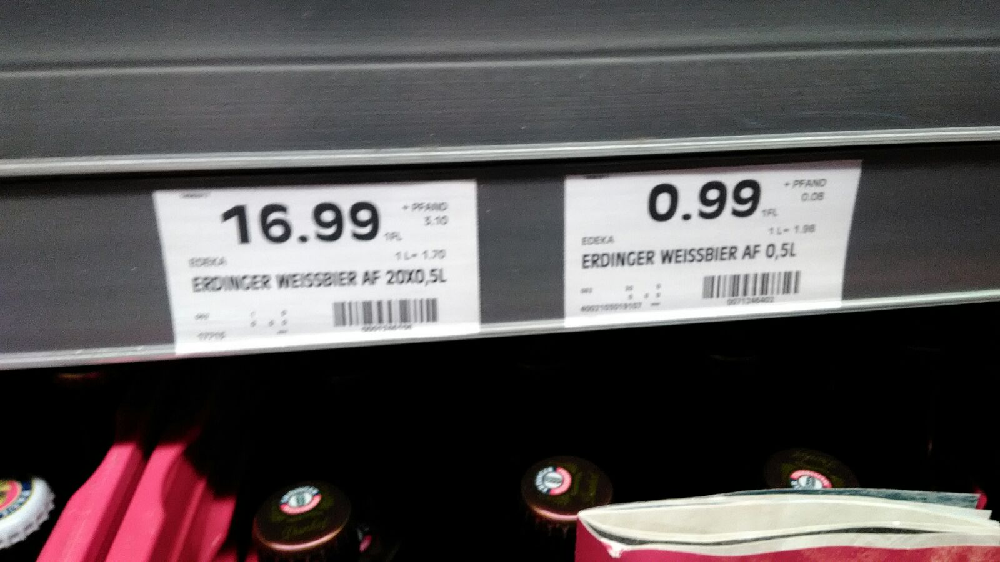

So I just bottle a pack of beers from [Stöertbeker](https://www.stoertebeker.com/) and now I am wondering how to recycle them, if possible.

Recently I went back to the market where there is a coffee shop where I was having a *MilchCafe* while observing how people were doing. I ended up having a clue about how it works. Although I have seems guys with packs of 10 or more beers putting all bottles in the bottom part of the machine. Did not realize how it works. Let me just check on the internet for more details while testing a Pilsner, of course.

One thing I confirmed reading [this article](https://geekmadel.com/2012/11/26/a-step-by-step-guide-to-recycling-your-bottles-in-germany/) is that the Pfand(deposit) that is written in the price labels is the value you will receive back when you put that bottle on the machine.

So I assume that if I buy a bottle of something that has the *pfand* price available, I can return it back and get some credit back. But, what about the other bottles I am not sure, like a bottle of milk? Will it work? Will I have to use the just go there and try approach? We will see soon.

 
