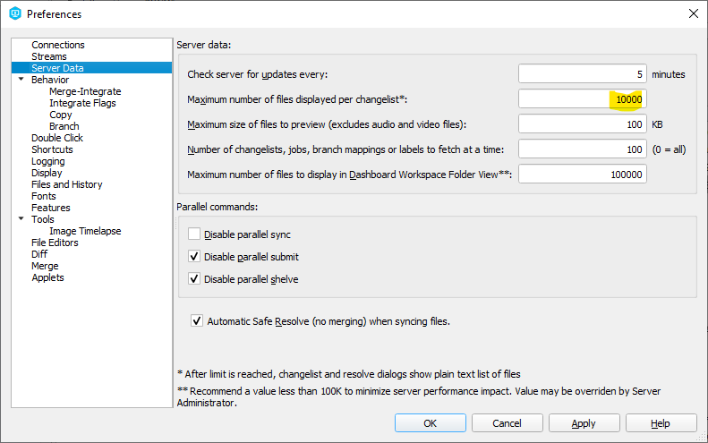

# Perforce P4V Maximum Changelist Number of Files Displayed

By default, there is a limit of files you can see in a changelist in [Perforce client P4V](https://www.perforce.com/downloads/helix-visual-client-p4v) .

But you can modify this limit by changing the "Maximum number of files to be displayed per changelist field:

I would say that such a high number of files in a changelist should be unlikely necessary, specially if you expect someone to review it.

I remember the endless discussions and complaints about Microsoft Excel not able to show more than 32767 lines. 

The question is what are you really looking at with such a high number of lines? Wouldn't that a summary, sorting, consolidation, grouping etc might not help your life easier?

In this case I was making a merging (integration) between two branches and there was more than 4000 lines of code. Then I was looking for some specific area, so I need to browse a few files.
