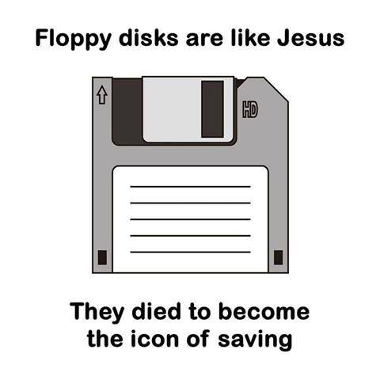

I remember when I was teaching the disciple of "Introduction to Informatics" to Production Engineering students at [UDESC](https://joinville.udesc.br). One day I asked:

Why the local disk you have in your PC is named as "C:"? Why not "A:" or "B:"?

As I got no answer back, I told them about floppy disks.

I am wondering if this generation (and the newer ones) had ever asked themselves why this weird symbol is used to save documents?

Icons are known to be good when they represent metaphors for concrete objects. If this is true, then I guess we may include "historical reasons" to the list.

PS: Maybe some asks about why not A or B in the comments.
