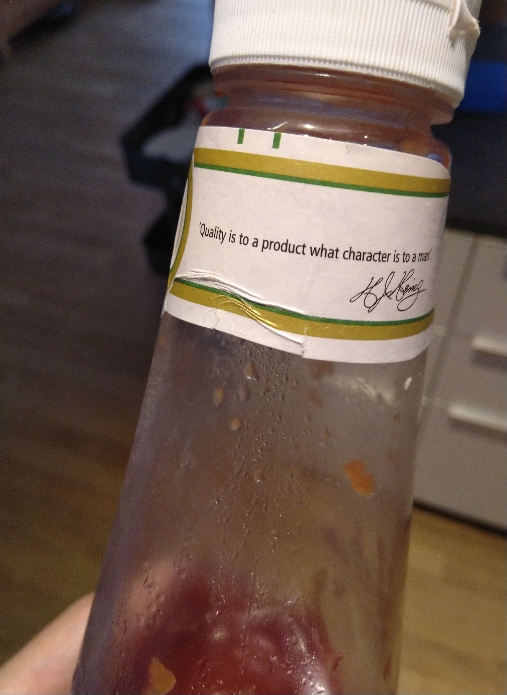

> Quality is to a product what character is to a man

I still do not understand quite well why I am almost paranoid about automated testing in software delivery business.

Maybe I should go the doctor, specially when I think about the subject after reading a ketchup bottle quote.

Considering testing is a quality improvement for a product, making these tests is an act of character for a software developer.

It is something you should not ask permission to do and at the same time be accountable for not doing.

You usually do not ask permission to have a good character, but you will definitely be blamed if you demonstrate otherwise.

I put a very high quality standard in the things I do, otherwise  I probably prefer doing nothing.

More into the details, write automated tests for me it is not just and extra task you must perform like "write unit tests",  most of the time erroneously addressed at the end of the development.

Instead, it is what will drive the next line of code I write. TDD anyone?

When you put automated testing in the front line of the developer daily work:

* Helps you constantly check if you are working to fulfil a certain criteria or it is just because you had a "great" idea. In case of the later, then either a new criteria should be added or you are losing focus

* Helps identify very quickly when a criteria is not testable, when other criteria are missing, when they are conflicting, ambiguous, if I need missing test data, etc

* Find new corner cases to add test coverage

Back in the 80's there was all these movements of having quality departments, groups etc. This is still common, but in general, the latest understanding is everyone should put quality in everything that is done, not to a specific department. And for coding is no different.