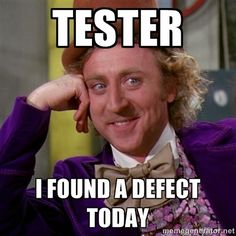

Sure. But I still think any manual testing script is a technical debt. Please tell me I am wrong.

But I also think it is better live with manual testing than without them at all. I see some situations where this may apply.

Usually, when we hear about TDD (Test-Driven Development) we automatically listen to "mocks", "dependency injection", "subject under testing" and so on so on.

I get it. There are discussions on that level if you prefer [classical or mocking testing](https://martinfowler.com/articles/mocksArentStubs.html#ClassicalAndMockistTesting).

This is not the point in this article.

My point is that we may be missing a good opportunity to insert a good team practice before jumping in to automate everything as the unique alternative to better software.

Can we still count on traditional manual testers and apply TDD principles?

What if, as soon a user story starts (or an accelerator), developer and tester work in parallel?

While the new feature is implemented, why not create a manual test script and make sure it fails?

 Isn't it what would be expected during a full fledge automated test? We write the test and make sure it fails before you add the expected functionality?

 I see in many teams a kind of anti-pattern where testers wait for developers to finish their work so they start executing the manual tests.

 If test cases are already written by that time, this is something good for sure. But how do you know if the tests themselves are actually testing what do you think you are testing, if you do not run them first and make sure it fails?

But one thing is sure: If adopting TDD makes you get clearance for the team, so it becomes a good justification for you increase your automated test coverage, go for it now!
